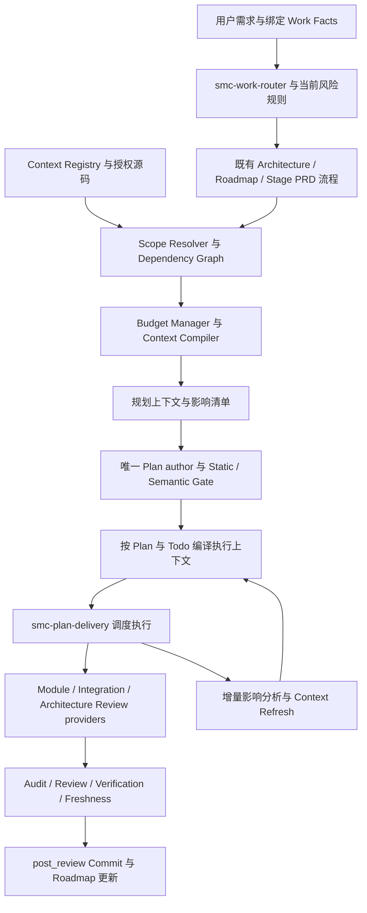

# GES v6.0.0 正式升级 PRD

本升级在现有 GES 治理运行时上增加项目、模块、组件的显式边界，以及可追溯、可预算、可失效的上下文编译能力，使 Agent 在保留交付门禁的前提下，只获取完成任务所需的上下文。

这是完整的升级产品需求评审稿，尚未经过 Architecture Review、PRD Review 与 Converge；`REVIEW_REQUIRED` 不代表已经批准实施或发布。本文件是版本级需求输入，后续按 Roadmap Item 拆分唯一 Stage PRD，不替代当前项目的 canonical Stage PRD、Plan 或已接受基线。所有新增 schema、路径与阈值均为本 PRD 的拟议契约，不是现有接口声明。v6.0.0 是合同升级：不设计、不保留在途旧 Plan 的兼容执行路径。

## 1. Objective

GES v6 的目标是把“已治理的任务如何交付”扩展为“先证明任务边界与必要上下文，再按现有治理链交付”。

1. 建立 Architecture、Project、Module、Component 的责任、代码与契约映射，支持单仓多项目及 Monorepo。
2. 在现有 Work Router 与 Delivery 之间加入 Context Optimization Engine（下称 COE），生成绑定当前任务和源码的 Context Package。
3. 对上下文选择、增量扩展、跨模块影响和 Token 使用形成可重放决策记录。
4. 通过现有 Review、Verification、Evidence Freshness 和 `post_review` 门禁证明交付完整性。
5. 为外部项目管理与 Agent 执行平台提供适配契约，保留 GES 对项目本地交付真值的唯一裁决。

产品定位沿用 GES 工程治理体系，平台化首先表现为契约、运行时和可安装接入能力。Web 控制台、中心调度服务与商业 SaaS 能力不构成本次 v6.0 首发定义。

## 2. 当前状态与升级依据

本节来自仓库文档和实现文件的只读核对；“实现存在”“本轮执行验证”“已接受生产基线”是不同结论。

### 2.1 版本基线

已接受基线由 `engineeing-skills/BASELINE.md` 裁决：GES-BASELINE-v1.0.0、Bundle 4.1.2、Pipeline v4.1、Plan contract `smc.plan.v3.3`，接受日期为 2026-09-03。

当前 `core/manifest.json` 的 Bundle 为 5.0.0；README 定义为 repaired candidate。工作树包含 v5.0.1 Hardening、v5.0.2 Closure、v5.0.3 Safety/Runtime 和 v5.0.5 Consumer Bootstrap 增量；这些 PRD 版本不等于已发布 Bundle 版本。v6.0.0 只走新合同路径，不再为 v3.6/v3.7 在途 Plan 保留兼容执行；未完成的旧合同 Plan 不在本升级范围内继续，不能按旧合同身份在 v6 运行时完成。

取证时工作区已有 `PACKAGE-MANIFEST.json`、`SHA256SUMS`、`consumer-bootstrap/validate_consumer.py` 修改，原始 v6 草案尚未跟踪。因此 `grounded_commit` 只是提交锚点，不代表所有观察内容都来自该提交；实施开始前必须重新冻结源文件摘要和实际基线。

### 2.2 当前架构与能力

现有 GES 是从中央权威目录发布到 Consumer 仓库的 overlay，拥有本地 Architecture → Roadmap → Stage PRD → Canonical Plan → Delivery 流水线。

- **路由与需求治理已存在。** `smc-work-router` 使用绑定 provenance 的 Work Facts 和结构化风险，决定 NONE/LEAN/FULL；`using-superpowers` 是兼容 shim。Architecture、PRD、Plan 各有独立 owner。
- **交付与证据治理已存在。** `smc-plan-delivery` 统一编排 Static、Semantic、Execution、Audit、Review、Verification、Freshness、Commit 与 Roadmap 更新。
- **有限上下文优化已存在。** 单 Todo brief、write-scoped review package、显式单文件/符号 source capsule、NONE/DELTA/FULL Plan Review、执行方法选择及任务批处理已有实现锚点。source capsule 记录内容 hash，但不推导依赖闭包；v6 应扩展这些能力。
- **领域与可复用资产已存在。** Domain Pack v2、Frontend/Backend/Ops provider、PRD Intent Binding、Test Asset Catalog 服务专业规则与测试资产复用；Domain 不等于业务 Module。
- **接入与安装治理已存在。** Consumer Profile、manifest/checksum、install lock/receipt、事务回滚，以及 Audit → Gap → Remediation → Apply → Validate 五段接入链已有实现。
- **外部方法接入已有分层。** Spec Kit probe/import 与 Superpowers 方法 provider 受 GES 桥接契约约束；脚手架存在不等于上游 CLI 或真实产品链验证通过。
- **验证框架存在，效果尚不能宣称。** 仓库包含包门禁、回归、Chaos、Pilot 和 Benchmark 工具；本轮不执行这些运行时测试，也不宣称当前工作树全部 PASS。相关闭环文档仍将真实 Pilot、Token Benchmark 与 Baseline promotion 列为禁入或待完成。

### 2.3 v6 能力缺口

当前证据未证明已具备统一的业务模块 Registry、通用模块/符号影响图、按预算编译的可重放 Context Package，以及跨执行平台的上下文约束协议。

升级需补齐：唯一 Module/Component 标识和代码归属、范围置信度与保守升级、依赖覆盖完整性、强制上下文保留、预算计量口径、内容绑定与缓存失效、越界读写约束、外部执行回执、真实收益评价和可回滚迁移。

## 3. 用户与典型场景

产品围绕研发人员、模块负责人、架构负责人、质量人员和交付负责人共同使用的任务与证据工作流设计。

- **组件调整：** 开发者修改局部展示行为，系统定位组件、宿主模块、相关约束和测试；不因“按钮颜色”字样自动认定低风险，设计系统公共 token 变更仍可升级影响范围。
- **模块功能：** 模块负责人新增业务能力，系统加载本模块设计、上下游契约、必要符号与测试资产；写集限定在已批准 Plan 范围。
- **公共依赖修改：** 开发者变更共享认证 SDK，系统识别反向依赖、受影响模块及应用，补齐集成审查和验证范围；小 diff 也可触发 FULL。
- **架构改造：** 架构负责人调整跨项目边界，系统引用已批准中央/本地架构与契约，通过分段上下文处理大范围信息，并保持完整约束清单。
- **存量 Consumer 升级：** 交付负责人先审计 Registry 与运行时能力，观察影子结果，再启用 v6 执行约束。升级不保留在途旧合同 Plan 的兼容执行；安装不得把未完成旧 Plan 续跑到 v6。
- **多 Agent 实施：** Delivery 按独立 Todo 分配上下文和写集，模块 Owner Agent 提供专业意见，审查意见由既有 canonical owner 汇总。

## 4. Out of Scope

v6.0 首发集中在本地可验证闭环，以下事项需要独立需求或后续版本。

- 新建第二个全局治理中心、跨仓 Feature/Work Package/IntegrationRun 状态机，或替换 Governance Kit。
- 重写 Plan、Todo、Proof、Roadmap 的四类状态，新增与 `smc-plan-delivery` 并列的生产交付控制器。
- 把缩减 Prompt 当成文件访问隔离，或承诺无执行器支持时仍能强制阻止任意仓库读取。
- 自动给所有存量仓库完成模块拆分、自动确定业务 Owner、自动批准依赖关系或架构变更。
- 默认接入 Multica、Hermes、Cursor 的线上系统、执行部署、真实 Pilot/Benchmark 或 Baseline promotion。
- 首发支持所有语言的精确调用图、全量历史 Review 向量库、跨组织多租户服务及管理控制台。
- 重命名历史路径 `engineeing-skills/`，或以新增 `*-v6` Skill 名称复制一套流水线。

## 5. 架构原则与 Production Owner

v6 保留现有治理所有权，新组件只拥有模块元数据和上下文派生产物，不获取需求、交付或发布裁决权。

### 5.1 中央与项目边界

ADR-001 保持有效：中央治理到 Interface，项目治理到 Implementation。中央拥有 Global Architecture、Feature、Global Roadmap、Contract Lifecycle、Work Package、Integration Gate 和 Evidence Index；GES 拥有项目本地 Architecture、Stage PRD、Plan、执行与交付证明。

本地 Registry 引用中央对象的版本与摘要，不复制可独立编辑的中央真值。跨仓依赖本地输出影响声明和证据引用；中央 Gate 仍决定集成状态。本地 PASS 不得产生中央 VERIFIED。

### 5.2 治理对象

Architecture → Project → Module → Component 表示约束继承与责任分解；Application 是部署/交付视图，可组合多个 Module，不强制作为 Component 的下级对象。

- Architecture 约束引用已批准决策，记录技术、数据流、依赖限制。
- Project 表示产品/工程责任范围；Project 与 Repository 可以多对多映射，v6.0 本地执行仅对当前仓库中声明的部分负责。
- Module 是核心业务治理单元，定义 Owner、代码边界、允许依赖、契约和 Review 责任。
- Component 是 Module 内的细粒度责任单元，必须有唯一宿主 Module；公共组件归共享模块，通过依赖关系复用。
- Application 声明使用的模块及发布映射，用于影响分析和 Release Review，不产生第二套发布状态。
- Domain Pack 表示 Frontend/Backend/Ops 等专业方法，和 Module 形成多对多关系，不得用 Domain activation 代替模块归属。

### 5.3 权限分配

每一类现有 canonical artifact 沿用原 owner；新增角色代表职责，不要求每个角色常驻一个 Agent。

- Architecture owner：原 `smc-architecture-decision`；架构审查仍由原 review owner 负责。
- Project/Roadmap owner：原 `smc-roadmap`；跨仓项目状态仍属中央控制面。
- Stage PRD/Plan owner：原 grounding、review、converge 与 Plan author；COE 不直接修改这些产物。
- Registry owner：Consumer 指定的架构/模块维护责任人，经当前治理链批准元数据变更。发现器只产生 proposal。
- Context Package owner：COE；只能写派生 Registry snapshot、impact manifest、context manifest 与诊断，不写 Todo/Proof/Roadmap。
- Execution owner：原 Delivery controller 调度 Developer Agent；Module Owner Agent、QA Agent 提供专业输入。
- Review/Release owner：原 canonical review、verification、delivery/roadmap owner；新 impact/release Skill 为 provider。
- Installer owner：继续独占 install lock、receipt 和 Consumer profile；Registry 的 Consumer 内容不得被 overlay 覆盖。

### 5.4 冻结不变量

所有 v6 上下文和成本决策必须服从现有 GES Frozen Invariants，尤其是单一 Plan、单一 writer、单一 Delivery owner 和证据新鲜度。

`Todo completed ≠ Plan proven ≠ committed ≠ Roadmap DONE`。成本不足、模型建议、缺少 telemetry、缓存命中均不能跳过 Blocking Verification；旧 blocking FAIL 不得以观察项形式继续 DONE。模块变更、契约变更或 context 绑定漂移必须重新判断相应证据有效性。

## 6. 目标架构与工作流

COE 作为现有路由、规划与交付之间的上下文服务，使用相同 Work Facts 和已批准 artifacts，不引入第二套任务路由真值。



流程中范围或治理意图变化必须回到当前治理 owner 处理，刷新上下文本身不能批准新的写集。

### 6.1 规划前与执行期的双阶段契约

Plan 创建前使用 `request_id` 和当前 Roadmap/PRD 引用进行发现；Plan 创建后使用 `plan_id + todo_id` 作为执行身份，二者通过 handoff 引用关联。

规划上下文是待审范围建议。执行上下文必须从已通过门禁的 Canonical Plan 派生，读集与写集明确分离，且写集不得超出 Plan。一个任务可以有多个顺序 context epoch，但只有一个当前有效 epoch；跨 Todo 批处理仍保留各 Todo 身份、状态和写集。

### 6.2 范围与风险正交

COMPONENT / MODULE / PROJECT / ARCHITECTURE 描述业务影响范围；SPIKE / BOUNDED / ARCHITECTURAL 与 NONE / LEAN / FULL 保留现有工作分类和治理语义。

两者不能按任务名称机械映射。认证组件修复可为 COMPONENT + FULL；共享样式或 Schema 变化可扩展到 PROJECT。模型给出的 task type、module 和 risk 仅为候选，必须由 Work Facts、Registry、diff 与契约证据校正。未知、冲突和覆盖不完整采用保守升级；同一工作项不得用上下文优化降低已确定的治理深度。

## 7. Change Classification 与功能需求

以下 Change ID 为版本级稳定追踪标识，Stage PRD 应引用原 ID 并细化，不得将现有能力重新包装为无来源的 ADD。

### C01 — ADD：Context Registry

建立可版本化、可验证的业务边界注册能力；它补充当前 Domain/Profile 元数据，不取代原有架构与需求真值。

- **FR-01：** Registry 支持 architecture、project、module、component、application 记录及依赖边。每个记录有稳定 ID、版本、Owner、source refs；Module 有 include/exclude、exports/contracts、allowed dependencies。
- **FR-02：** 路径按实际文件系统身份规范化，处理 Windows 大小写、短路径、junction/symlink、仓库相对路径和 rename；拒绝仓库外路径与无法证明身份的条目。exclude 优先；根规则、锁文件、共享配置必须显式归属，不得丢弃。
- **FR-03：** 文件可以有多条“受影响”关系，但只有一个规范写入责任 Module。重叠 include、未知 Owner、悬空 contract ref 必须产生诊断；用户显式声明的共享模块解决重叠，不用最长路径猜测掩盖冲突。
- **FR-04：** 发现现有目录和 imports 只生成 proposal；Owner 接受后形成 reviewed Registry。Registry snapshot 固定源码版本、配置摘要和解析器版本。
- **验收：** AC-01、AC-02、AC-03。

### C02 — MODIFY：Work Router 与 Task Analyzer

扩展原 Work Facts 路由以携带模块范围建议，保留风险判定和 artifact-state-routing 的唯一真值。

- **FR-05：** 输入需求、authoritative artifact refs、当前 diff/候选路径、Registry 和已有 risk facts；输出范围、证据、置信度、升级原因及未知项。每个决定必须可追到来源。
- **FR-06：** Task Analyzer 不通过 prompt 自述产生 `governed=false`。已有 governed artifact 的工作继续进入现有流水线；NONE 条件仍由原 Router 判定。
- **FR-07：** 单任务读取新增依赖可扩大上下文；若实际修改范围扩大，必须由 Plan owner 更新 Change Matrix 并重新通过相关门禁。识别不了范围则返回阻断或保守全范围治理结果，不能以“组件任务”继续执行。
- **验收：** AC-04、AC-05、AC-11。

### C03 — ADD：Dependency Graph 与 Impact Analysis

建立可解释的依赖与反向影响视图，为上下文选取和 Review 提供必要覆盖证据。

- **FR-08：** 首发必须支持 Registry 声明依赖、契约引用、版本化 package manifest/workspace 依赖，以及至少一个经 Stage PRD 指定并验证的语言适配器；未支持语言明确标记覆盖缺口，不承诺全语言精确分析。
- **FR-09：** 每条边记录来源、类型、解析版本与置信信息；支持直接依赖和反向传递闭包，循环依赖有稳定结果，增删、rename、锁文件、export/API 变更使相应子图失效。
- **FR-10：** 影响清单覆盖模块、组件、应用、契约、需审查项和验证需求。未解析 import、动态加载、生成代码或跨仓引用标记 `INCOMPLETE`，禁止把空结果当“无影响”。必要时提升到项目/架构审查并列出人工确认项。
- **FR-11：** 首次索引可读取授权仓库范围并计入成本；后续按源码/配置变化增量更新。单个组件任务不得重复触发无理由的全仓扫描。
- **验收：** AC-06、AC-07、AC-15。

### C04 — MODIFY + ADD：Context Compiler 与 Budget Manager

复用已有单 Todo brief 和 review package 的消费位置，新增统一选择、预算、来源、排除理由和内容绑定协议。

- **FR-12：** Context Package 至少包含 governing constraints、任务目标/AC、模块边界、相关 contract、必要实现符号、相关测试与资产、影响清单、允许读写范围和未决风险。规范性约束与 exact contract 必须保留可核对原文片段，历史摘要只作辅助数据。
- **FR-13：** context manifest 对每项记录路径/对象、版本或内容摘要、选择原因、mandatory 标记与估算 Token；对未选项记录可聚合的排除原因。相同输入和固定选择策略产生相同规范化 manifest 摘要；非确定性摘要必须固定产物摘要后才能重放。
- **FR-14：** 预算按模型实际窗口上限扣除系统输入、工具返回预留、输出和安全余量，再与任务政策上限取最小值。强制项优先；强制项放不下时分段处理、申请政策内预算扩展，或返回明确 BLOCKED，不能截断后成功。
- **FR-15：** 执行、Review 和 Verification 可使用不同 package；独立 Review 必须具有判断全部当前 diff 与 blocking obligations 所需上下文，不能仅看到 Developer 摘要。
- **FR-16：** 扩展上下文必须记录触发原因、增量来源、新 epoch 与预算变化。工具读取和子 Agent 消耗进入任务总账；缓存命中不抹除上下文实际占用。
- **验收：** AC-08、AC-09、AC-10、AC-13、AC-18。

### C05 — MODIFY：Delivery 与上下文有效性门禁

在原执行和审查边界校验 Context Package，沿用 scoped workspace、content fingerprint、证据 freshness 和单 writer。

- **FR-17：** 执行前检查 package 与当前 Plan semantic hash、源码内容、Registry、graph、policy、工具/解析器版本一致。HEAD 相同但 dirty 内容变化也须被识别。
- **FR-18：** Plan、模块边界、必要 contract 或实际源码变化使相关 package 失效；重新编译后按现有 freshness 规则重判受影响 proof，不能复活 STALE/FAIL。
- **FR-19：** 写权限是 Canonical Plan 写集与宿主 enforcement 能力共同约束的结果，Context Package 中出现某文件不自动授权修改。越界或 preexisting ambient mutation 由 Delivery 阻断并保存差异证据。
- **FR-20：** 宿主读取机制必须显式声明 `ADVISORY|ENFORCED`。只有工具/文件读取网关或等价隔离通过验证才声明 ENFORCED；ADVISORY 允许受控试用，但禁止宣称读取隔离或进入要求隔离的生产策略。
- **验收：** AC-10、AC-11、AC-12、AC-16。

### C06 — MODIFY：Review Governance 与 Skill 体系

新增模块影响审查内容，沿用现有 canonical reviewers 和 provider 架构，不增加 Plan 或 Delivery owner。

- **FR-21：** Module Review 检查业务边界、Owner、contract 与局部质量；Integration Review 检查公共依赖、API/schema、反向影响与集成验证；Architecture Review 处理边界、约束或长期结构变化。触发结果由影响与风险决定，可同时需要多个 provider。
- **FR-22：** 原草案的 `smc-context-analysis`、`smc-module-discovery`、`smc-impact-review`、`smc-release-review` 定义为可新增 provider 入口；先证明现有 owner 无等价可扩展入口，再由 Phase 0 冻结发布清单。
- **FR-23：** 草案 `smc-plan-v6` 映射为扩展现有 `smc-plan-from-approved-prd-ponytail`；`smc-execute-v6` 映射为现有 Delivery + execution providers 的协议升级。首发不发布第二套同义 production owner，也不发布旧名称或旧合同的兼容入口。
- **验收：** AC-12、AC-14、AC-19。

### C07 — MODIFY：Consumer Bootstrap、安装与平台适配

沿用现有安装 provenance 和分层接入验证，增加 Registry、COE 及执行宿主能力检查。

- **FR-24：** Audit/Gap 识别 Registry 缺失、版本不兼容、索引过期、宿主计量/读取能力不足；Remediation 默认 dry-run，只补缺失，不覆盖用户维护的 Registry 或 installer 独占 profile。
- **FR-25：** 安装升级验证 manifest/checksum、版本兼容、实际 package bytes、immutable receipt、self-test 与 Consumer validator；失败按原事务模型回滚。
- **FR-26：** Multica 可提供项目/任务映射，Hermes 可提供编排/执行适配，Cursor Agent CLI 可提供代码执行能力；这些是目标角色映射，不代表已验证串联关系。具体适配器必须报告能力、版本、请求/结果相关 ID、输出摘要、工具访问能力和 Token 可用性。
- **FR-27：** 外部 DONE 仅是执行报告，不能写本地 Roadmap DONE；重试使用同一 dispatch identity 去重，超时、失联和版本不支持返回明确状态，不伪造 Evidence。
- **验收：** AC-16、AC-17、AC-20。

### C08 — MODIFY：Telemetry、评估与发布证据

在已有 dispatch telemetry 上增加上下文计量，单独证明成本效果，不把观测数据升级为交付证据。

- **FR-28：** 记录预估/实际 input、output、cache read/write、tool、retry、reviewer、子 Agent 和总量，绑定 request/Plan/Todo/context epoch/dispatch。不可获取的值用缺失状态，不以 0 或估算冒充实际。
- **FR-29：** 观测缺失按现有规则不自动阻断普通 Delivery，但必须阻止 Token 收益认证。使用成本作为预算强制条件的宿主缺少计量能力时，预算控制只能标记估算并禁止宣称精确封顶。
- **FR-30：** 评估必须配对同源任务、模型、工具、源码、验收 oracle 和资源设置；同时报告质量、阻断、重试、审查与索引成本。旧 candidate 的未完成 Pilot/Benchmark 不因 v6 文档自动变成通过。
- **验收：** AC-18、AC-21、AC-22。

## 8. 核心数据契约

本节冻结产品可观察字段及真值归属，具体存储格式、私有类和函数由 Stage PRD/Plan 决定。

### 8.1 Registry 与 source refs

拟议 schema 家族为 `smc.context.registry.v1`、`smc.context.impact.v1`、`smc.context.package.v1`；批准前均不得宣称当前运行时支持。

Registry 必填：schema、registry_id、revision、repo_identity、source_refs、projects、modules、components、applications、constraints、dependencies。source ref 包括 artifact identity、revision、digest 和 authority；缺少批准状态的发现结果标注 PROPOSED，不能作为强制规范。

建议 Consumer 将 canonical 配置置于 `.agents/ges/context/`，包括 `architecture.yaml`、`project.yaml`、`modules/<id>.yaml`、`components/<id>.yaml` 与 `applications/<id>.yaml`。这些文件保存引用、边界和机器约束，不复制可独立更改的架构正文。此位置是新提案，不创建第二个 `.ges/` 管理根；实际路径由 Phase 0 契约评审冻结。

### 8.2 Task Context Request 示例

请求对象只携带工作身份和约束，不新增可写任务完成状态；下例用于展示执行期契约。

```yaml
schema: smc.context.request.v1
request_id: REQ-KNOW-001
phase: EXECUTION
binding:
  plan_id: PLAN-KNOW-001
  todo_id: TODO-03
  plan_semantic_sha256: "<digest>"
  work_facts_digest: "<digest>"
project: copilot
modules: [knowledge]
components: [preview]
scope_level: COMPONENT
risk_facts_ref: "<canonical-work-facts-ref>"
budget:
  initial_context_tokens: 20000
  max_task_tokens: 80000
  policy_ref: "<versioned-policy-ref>"
source_snapshot:
  repo_identity: "<canonical-repository-identity>"
  head: "<commit>"
  content_digest: "<working-content-digest>"
registry_digest: "<digest>"
graph_digest: "<digest>"
```

规划期 `phase: PLANNING` 不伪造 plan_id/todo_id，绑定 request_id、Roadmap/PRD/source refs；编译出的 package 不具有执行授权。上述数字为示例政策值，不是现有默认值或实测成本。

### 8.3 Context Package

Package 是可再生、只读的执行输入，至少包含以下字段集合。

- 身份：schema、package_id、request_id、phase、plan_id/todo_id（执行期必填）、epoch、created_at。
- 绑定：Plan semantic hash、Work Facts digest、源码内容摘要、Registry/graph/policy digest、compiler/tokenizer/provider 版本。
- 范围：scope level、modules/components、read_set、write_set_ref、enforcement_mode、impact refs。
- 选择：mandatory items、selected items、source refs/digests、estimated tokens、excluded reasons、unresolved obligations。
- 预算：模型窗口与保留量、initial cap、累计任务限额、剩余额度、使用量的 estimated/measured 标识。
- 状态：`READY|INCOMPLETE|BLOCKED|STALE`、reason codes、当前验收义务与扩展建议。

执行和依赖其结果的门禁只接收有效 READY package；INCOMPLETE 只能用于诊断和影子观察。缓存不得覆盖已发出的 package；当前 epoch 指针由受控编译/调用流程更新。

建议派生产物沿用 `.smc/runs/<plan_id>/context/<todo_id>/<epoch>/`；规划前放在 `.smc/context/requests/<request_id>/`。持久 evidence manifest 保存可重放的身份和摘要；原始源码/敏感 Prompt 留在 Consumer 授权的本地证据存储，不默认上传中央。

### 8.4 失败语义

失败必须有可区分原因和恢复路径，不能用一个成功状态携带未完成义务。

- `CONTEXT_REGISTRY_INVALID`：重复归属、未知 Owner 或非法引用；修订 Registry 后重验。
- `CONTEXT_SCOPE_UNRESOLVED`：无法证明范围；补充绑定证据或提升治理范围。
- `CONTEXT_GRAPH_INCOMPLETE`：依赖覆盖不足；补充声明/适配器或建立经审查的保守影响范围。
- `CONTEXT_MANDATORY_OVER_BUDGET`：强制内容放不下；分段、政策内扩展或阻断。
- `CONTEXT_BINDING_STALE`：Plan/内容/规则漂移；重编译并重判相关门禁。
- `CONTEXT_ACCESS_UNSUPPORTED`：宿主达不到要求的读取约束；切换支持的宿主或停在影子模式。
- `CONTEXT_WRITE_SCOPE_VIOLATION`：写出批准范围；由 Delivery 按既有 scope 失败语义处理，禁止继续提交。
- `CONTEXT_TELEMETRY_INCOMPLETE`：无法认证收益；保留原交付门禁语义，禁止生成成本 PASS。
- `CONTEXT_LEGACY_PLAN_UNSUPPORTED`：遇到 v3.6/v3.7 在途未完成 Plan；v6 拒绝执行，不提供兼容完成路径。

这些码是 v6 新增诊断名称；对外应同时保留当前 Router/Delivery 的 canonical verdict，不以新码覆盖原失败事实。

## 9. Token Budget 与成功指标

Token 优化属于待验证产品目标，治理正确性是发布硬门槛，任何节省目标都不能覆盖失败或缺失证据。

### 9.1 预算口径

原始草案给出的 5k–20k、30k–80k、80k–200k、200k+ 被解释为按场景校准的上下文规模参考，不直接作为所有模型的固定输入额度。

- COMPONENT：初始上下文建议 5k–20k。
- MODULE：初始上下文建议 30k–80k。
- PROJECT：累计上下文需求参考 80k–200k，必要时分段，单次输入仍受窗口限制。
- ARCHITECTURE：可能需要超过 200k 的累计信息处理；必须有显式任务总预算和分阶段分配，不允许“200k+”代表无限额度。

`单次可用上下文 = min(场景政策上限, 模型窗口 - 系统输入 - 工具预留 - 输出预留 - 安全余量)`。任务总量包括所有轮次、工具、重试、子 Agent 和 reviewers；输入在多个调用重复发送时重复计入实际总量。Token 计数使用固定 tokenizer 或 provider 计量，缺失时说明估算误差，预算数值不能解释为价格或质量承诺。

### 9.2 拟议发布目标

以下阈值供本正式 PRD 评审冻结；当前值均未测量。阈值变更需记录理由和评审结果，不得在看到结果后静默调低。

1. 强制约束/验收义务保留率：固定 fixture corpus 达到 100%；发现任一遗漏即阻断相关能力发布。
2. 越界写拦截率、STALE 检出率、重复 owner 检出率：对应负向用例 100% 通过。
3. 声明依赖与受支持解析器的种子影响图召回率：100%；未知覆盖必须显式报告，不能从统计分母删除。
4. 重放一致率：固定输入的规范 manifest digest 100% 一致。
5. 配对任务质量：所有 blocking AC 均通过，首次验收通过率不得低于配对基线，不能以额外人工修复掩盖回归。
6. 成本目标：COMPONENT 与 MODULE 两组各自的任务总 Token 中位数较当前可重放 v5 candidate 基线降低至少 30%；PROJECT/ARCHITECTURE 先要求质量和可解释预算，不预承诺 30%。
7. 在线解析/编译延迟目标：在固定的 10 万 tracked files、2 千 Module/Component 记录的本地测试夹具上，热索引 P95 ≤ 5 秒；硬件、缓存状态及 fixture 摘要必须随报告保存。冷索引单独记录，不能从端到端成本中隐藏。

### 9.3 Benchmark 协议

真实 Benchmark 在独立获批的评估阶段执行；本 PRD 仅规定方法和退出条件。

建议至少 24 个配对任务，四个范围各 6 个，其中包含安全/契约高风险、公共依赖、缺失 graph、边界冲突和回滚场景；每对至少重复 3 次并保留所有运行。固定模型、工具版本、源码、验收 oracle 与设置，轮换执行顺序，报告分布和异常，不只提供平均值。

基线优先使用冻结且可重放的实际 v5 candidate 字节，与 v6 同条件运行；4.1.2 接受身份不自动使其适合作成本对照。无法复现基线、dispatch 不配对或实际 Token 不完整时，沿用现有评估词表输出不可认证/未达阈值结果，不宣称节省。旧验收矩阵要求保持有效；最终矩阵应取现有 release gate 与本 PRD 要求的并集。

## 10. 安全、性能与可运维性

上下文控制必须对访问、完整性和故障恢复给出可验证承诺，同时避免夸大其提供的隔离强度。

- **访问与内容安全：** 索引与读取必须服从 Consumer 的访问策略；密钥、被排除目录和仓库外内容不能因依赖关系进入 package。源码、文档和历史 Review 中的指令视为数据，不能改写治理政策。
- **缓存隔离：** cache key 包含仓库身份、访问策略、内容/Registry/graph/policy/compiler 摘要；跨工作区或权限变化不得复用不匹配缓存。撤销访问后重新读取必须失败，相关缓存按 Consumer 保留策略失效/清理。
- **资源控制：** 图构建有时间/内存与节点上限；触达上限返回 INCOMPLETE 并说明覆盖，不静默返回截断闭包。
- **并发控制：** 多 Agent 可以并发读 snapshot；写集重叠、共享热点或依赖 Todo 禁止无序并行。scope epoch 变化后旧 worker 回执不能被误接收到新 epoch。
- **故障恢复：** package 采用完整写入后发布；中途崩溃不产生 READY。索引可重建，失败保留最后有效 snapshot 供诊断，但 stale snapshot 不获得执行许可。
- **隐私与保留：** 原始 Prompt/源码不默认进入 telemetry；保留期限、日志读取权限与删除策略由 Consumer profile/policy 提供，发布前必须有配置和回归证据。
- **可解释性：** 开发者可查看“为什么选中/排除”“为什么扩大范围”“为什么预算不足”，无需理解内部模型推理过程。

## 11. 升级与迁移

v6.0.0 是显式合同升级，不为在途旧 Plan 保留兼容执行。已完成工作的证据历史只读保留；未完成的旧合同 Plan 不在 v6 运行时继续。

### 11.1 版本策略

文档版本 v6.0.0 不触发 Bundle、Plan、Domain 或 Consumer Profile 自动升版；各版本轴分别由评审和发布流程裁决。

Phase 0 必须冻结 v6 enforcement 的 Plan/extension 能力：以显式新合同或必需 extension 声明 context binding。旧 validator 对必需而不支持的能力必须拒绝，不能忽略字段后 PASS。v6 运行时对 v3.6/v3.7 在途未完成 Plan 必须拒绝执行，不得提供兼容完成路径。本文不预先宣称 `smc.plan.v3.8` 或其它新号已存在。

### 11.2 四步启用

按 Consumer/工作项逐步启用 COE，仅作用于 v6 新合同工作；执行模式与验收声明保持一致。启用过程不考虑、不续跑在途旧合同 Plan。

1. **Disabled：** 安装和审计能力可存在，不引入 COE 执行要求；该模式不是旧合同 Plan 的兼容执行通道。
2. **Shadow：** 对新工作产生 Registry/impact/context 观察结果，不改变原路由/执行权限；差异作为诊断，不能宣称强制隔离。
3. **Advisory：** 经独立阶段批准后向支持的 Agent 提供上下文，写集仍由原 Delivery 严格校验；读取约束能力如实标识。
4. **Enforced：** 仅对显式 opt-in 的新合同工作生效，要求完整 Registry、依赖覆盖策略、可用宿主、fresh package 和当前门禁。

升级不迁移、不续跑 v3.6/v3.7 在途工作。历史已完成 Plan 的 identity 与证据只读保留，不得在有实现差异时用重建 baseline 隐藏变更。

### 11.3 回滚

安装回滚和任务合同回退是两件事；成功还原文件不代表未完成工作可以按旧合同在新旧运行时之间切换续跑。

安装失败按现有 transaction/receipt 还原 package-owned 文件，Consumer Registry 保留且不被覆盖。已启用新必需能力的 Plan 在旧运行时必须阻断。v6 不提供把在途旧合同恢复为可执行路径的兼容迁移。回滚不重置 blocking FAIL、篡改旧 evidence，也不直接修改 `BASELINE.md`。

## 12. Acceptance Criteria 与 Acceptance Claim Baseline

本节定义可观察结果及所需证据；目前所有新增 AC 状态均为 NOT_EXECUTED。具体测试命令、fixture 实现和 LIVE/FAULT/EXTERNAL Scenario binding 在对应 Stage PRD/Plan 中冻结。

每项执行证据至少绑定 Change ID、AC ID、Scenario ID、Plan identity、candidate 字节摘要、输入/输出摘要和运行 verdict。环境缺失记为 PRECHECK BLOCKED，不能伪装产品 FAIL 或 PASS。历史 PASS 复用须显式验证新鲜度；历史 blocking FAIL 保持 residual gap。

- **AC-01（C01，blocking）：** 同一文件被两个 canonical Module 覆盖时 Registry 校验失败并列出冲突；显式共享模块归属后成功。证据：冲突/修正输入与诊断。
- **AC-02（C01，blocking）：** Windows 短/长路径、大小写别名指向同一实体；仓库外 junction/symlink 不获得读取或写入许可。证据：平台路径回归与实际身份结果。
- **AC-03（C01，blocking）：** 缺 Owner、悬空契约、PROPOSED 边界不能产生 enforced READY。证据：Registry 校验与模式判定。
- **AC-04（C02，blocking）：** Prompt 声称“只研究”或“低风险”不能覆盖 governed/production facts；输出保守 profile 和来源。证据：绑定 facts 与 Router verdict。
- **AC-05（C02，blocking）：** 局部认证/公开契约变化即使只有一个文件也保留 FULL；相同 task scope 不保证相同风险。证据：正反例事实与路由。
- **AC-06（C03，blocking）：** 共享 SDK 修改产生全部种子直接/反向受影响模块与应用；环与 rename 不使闭包丢失。证据：预期图、实际 impact manifest。
- **AC-07（C03，blocking）：** 未解析动态依赖或索引截断输出 INCOMPLETE；未处理覆盖义务时阻止 enforced 执行。证据：不完整原因、升级/阻断结果。
- **AC-08（C04，blocking）：** COMPONENT package 保留完整相关约束、AC、contract 和必要 tests，同时排除有证据证明无关的业务源码。证据：选择清单、mandatory coverage 与排除理由。
- **AC-09（C04，blocking）：** mandatory 内容超限时不截断输出 READY；返回预算阻断或经记录的分段方案，各段共享完整义务追踪。证据：预算输入与编译结果。
- **AC-10（C04/C05，blocking）：** 同一输入重复编译摘要相同；HEAD 不变但源码/Registry/contract 变化使旧 package STALE。证据：重放摘要与失效事件。
- **AC-11（C02/C05，blocking）：** 扩大读范围不扩大写集；新增模块写入、未批准文件与 ambient mutation 被 Delivery 阻断。证据：Plan 写集、实际 diff、失败结果。
- **AC-12（C05/C06，blocking）：** 新 provider 无法写 Todo/Proof/Roadmap 状态；修改实现后旧 proof 失效；Commit 与 DONE 顺序仍满足原不变量。证据：ownership 与门禁回归。
- **AC-13（C04，blocking）：** Reviewer 获取当前完整受审 diff 及所有 blocking obligations，不能仅凭 worker 摘要出 PASS。证据：review package 与 canonical verdict 绑定。
- **AC-14（C06，blocking）：** 跨模块 API 变更触发 Integration Review，架构边界变化触发 Architecture Review；未完成必需审查不能 release。证据：影响触发与门禁输出。
- **AC-15（C03，blocking）：** 热索引上的局部变更只更新相关子图，global config 变化可解释地扩大刷新；扫描规模和冷启动成本被记录。证据：索引诊断与计量。
- **AC-16（C05/C07，blocking）：** 无读取 enforcement 的宿主报告 ADVISORY；要求 ENFORCED 的策略拒绝该宿主。证据：capability handshake 与实际访问负例。
- **AC-17（C07，blocking）：** bootstrap dry-run 不修改治理源；apply 不覆盖 Consumer Registry，失败可回滚且 receipt 可核验。证据：前后文件摘要、安装/回滚回执。
- **AC-18（C04/C08，收益认证 blocking）：** 子 Agent、重试、Review 与工具消耗纳入配对总账；缺失或重复 dispatch 不能生成成本认证 PASS。证据：原始 telemetry 与聚合一致性。
- **AC-19（C06/迁移，blocking）：** 不发布第二套 owner 或旧合同兼容入口；不支持 v6 必需能力的 validator 明确拒绝；v3.6/v3.7 在途旧合同不得在 v6 运行时继续执行。证据：版本/能力拒绝矩阵执行结果。
- **AC-20（C07，启用外部适配器时 blocking）：** 外部重复/超时/旧 epoch 回执不重复完成 Todo；外部 DONE 不能绕过本地 verification/commit gate。证据：适配器 fault scenario 与状态变化记录。
- **AC-21（C08，发布 blocking）：** 配对任务的全部 blocking AC 通过，首次验收通过率不低于基线，未执行/环境阻断单列；无真实数据不得写收益结论。证据：质量与失败完整报告。
- **AC-22（C08，收益声明 blocking）：** 两个目标 cohort 分别达到 §9 的 Token 阈值，性能结果满足冻结条件；未达标标明 cost/performance gap。证据：可重放配对报告与原始计量。
- **AC-23（安全，blocking）：** 源码/Review 中的注入文本不能修改政策；排除目录/密钥不进入 package，权限撤销后旧缓存不可用于读取。证据：攻击输入、访问与缓存失效测试。
- **AC-24（迁移，blocking）：** 新合同启用后回滚旧 runtime 必须阻断未完成的 v6 工作，不得用兼容路径续跑在途旧合同 Plan；保留 FAIL 与 receipt。证据：升级/中断/回滚端到端记录。

“收益认证 blocking”仅阻止收益通过声明，普通 Delivery 仍沿用现有 telemetry 规则；v6 正式发布若要接受成本缺口，必须采用既有 Release Review 支持的明确 verdict，不能改写 AC 结果或宣传达标。安全与治理 blocking 不得以成本缺口裁决豁免。

## 13. 实施路线与交付物

沿用原草案四阶段主线，增加前置契约冻结与发布闭环；按依赖推进，不用未经估算的日期承诺交付。

### Phase 0 — 基线与契约冻结

先完成 v6 Architecture Decision 和 Upgrade PRD review，再建立 Roadmap 与各阶段 Stage PRD。

交付：实际源快照、现有能力/残余缺口清单、对象与 owner 决策、Registry/context schema、Plan 能力协商、首发语言/Consumer/宿主、预算阈值及无在途兼容的升级策略。退出条件：§14 的阶段阻断项已有决策、Architecture 与对应 Stage PRD APPROVED；本升级稿不冒充这些结果。

### Phase 1 — Context Registry

实现 C01 与 C07 的审计扩展，建立可治理的业务边界和最小声明依赖图。

交付：Registry 校验/发现 proposal、引用与路径身份规则、bootstrap gap、固定 fixture 与 Windows 回归。退出条件：AC-01–03、AC-17 通过；现有包与治理回归通过。只有 Registry 通过并不允许直接 enforced 执行。

### Phase 2 — Context Optimization Engine

实现 C02、C04、C05 和必要 telemetry，先在声明依赖覆盖可证明的范围中形成影子闭环。

交付：Task Analyzer、Scope Resolver、Budget Manager、Context Compiler、epoch/freshness、旧 brief 消费适配、能力 handshake。退出条件：AC-04–05、AC-08–13、AC-16、AC-18–19、AC-23–24 通过；未完成图覆盖的工作停留 shadow/advisory，禁止提前宣称生产最小上下文正确。

### Phase 3 — Impact Analysis 与 Review

实现 C03、C06，补齐实际代码依赖、反向影响、失效和 Review 触发，再开放受支持范围的 enforced 模式。

交付：首发语言适配器、impact manifest、增量图、Module/Integration/Architecture review 接入与安全故障验收。退出条件：AC-06–07、AC-14–15 通过，mandatory coverage 与 graph completeness 可重放，所有 Phase 1/2 门禁持续通过。

### Phase 4 — Multi-Agent Organization 与平台适配

在单任务闭环成立后扩展模块角色、独立 Review/QA 和外部调度适配，不改变写所有权。

交付：模块任务分派、共享热点与依赖检测、dispatch/epoch 关联、至少一个预先选定宿主的端到端能力证明。退出条件：AC-12、AC-16、AC-18、AC-20 通过；未验证适配器继续标注 planned/adapter ready，不能宣称所有外部平台集成完成。

### Release Readiness — 独立评估与候选接受

真实 Consumer Pilot、Token Benchmark、baseline/release 决策通过单独批准的工作项开展，本次文档编写不执行它们。

交付：AC-21–22 配对证据、现有 acceptance/pilot/chaos/package gate 的完整结果、旧合同拒绝与回滚矩阵、剩余风险、Release Review verdict。依次通过候选发布、Consumer 验证和接受流程后，才允许更新 accepted baseline 与正式 release identity；不得倒置为“先 promotion，再补证据”。

## 14. 待决策项与风险

以下项目需要在对应阶段开始前形成明确记录；它们不妨碍完成本需求评审稿，也不被默认视作已批准。

- **D01（Phase 0）：** 项目方指定产品、架构、模块和发布责任人；当前仅定义角色，不虚构实际任命。
- **D02（Phase 0）：** 确认平台化范围继续遵守 ADR-001。若要迁移中央所有权，另提 MAJOR governance change；本 PRD 推荐保留边界。
- **D03（Phase 0）：** 冻结 Registry 布局、schema 和 v6 Plan 必需能力；必须验证旧 runtime 拒绝新必需字段，以及 v6 runtime 拒绝在途旧合同，不提供兼容完成路径。
- **D04（Phase 0）：** 指定首发 Consumer、语言适配器、宿主和本地读取强制机制；草案中的产品/平台名均不能代替可验证接入清单。
- **D05（评估阶段前）：** 冻结预算、硬件、任务 corpus、成本阈值和失败统计方法，明确延续哪些旧验收矩阵要求。
- **D06（真实评估前）：** 单独批准解除相关工作项的 Pilot/Benchmark 禁入范围，并处理旧 candidate 的未完成接受项；本文件不授予生产推广权限。

主要风险包括错误归属导致漏上下文、动态依赖导致影响漏报、摘要丢失规范性约束、第三方宿主缺少读取/计量能力、Registry 与 Plan 双写，以及用新版本号掩盖旧 candidate 验证缺口。对应控制分别是冲突阻断、覆盖状态与保守闭包、mandatory 原文/摘要绑定、能力声明、唯一 owner、独立发布证据。

## 15. Source Anchors 与需求追踪

原始草案保留为需求来源，本正式稿负责补充实施边界和验收语义；发生冲突时，当前 APPROVED ADR 与 Frozen Invariants 优先，设计变更需走其原审批链。

### 15.1 来源锚点

以下均为仓库内可定位来源，不以草案推断实现存在。

- [原始 v6 架构草案](PRD-v6.0.0-with-Context-Optimization-Engine.md)：§1–17 的目标、层级、COE、角色、技能、预算和阶段。
- [GES 总览](../../lat.md/ges/ges.md)、[身份边界](../../lat.md/ges/identity.md)、[技能所有权](../../lat.md/ges/skills.md)：当前定位、版本轴和 canonical owner。
- [Accepted Baseline](../../engineeing-skills/BASELINE.md)、[当前 Core Manifest](../../engineeing-skills/core/manifest.json)、[candidate README](../../engineeing-skills/README.md)：接受状态与实际 Bundle 身份。
- [ADR-001](../../lat.md/decisions/ADR-001-central-local-boundary.md)、[中央架构](../../lat.md/architecture/architecture.md)：中央/本地治理边界。
- [流水线](../../lat.md/ges/pipeline.md)、[Frozen Invariants](../../lat.md/ges/invariants.md)、[Plan Delivery](../../lat.md/ges/plan-delivery.md)：状态、门禁和证据规则。流水线页面的历史 router 表述以当前 owner 文档和实现为准。
- [Runtime Cost](../../lat.md/ges/runtime-cost.md)、[Acceptance Hardening](../../lat.md/ges/acceptance-hardening.md)、[Architecture Closure](../../lat.md/ges/governance-architecture-closure.md)：已有上下文、路由、风险、telemetry 与命名迁移。
- [Domain Packs](../../lat.md/ges/domain-packs.md)、[Test Assets](../../lat.md/ges/test-assets.md)：领域 provider 与测试资产复用。
- [Safety/Runtime Closure](../../lat.md/ges/safety-runtime-closure-v503.md)、[Consumer Bootstrap](../../lat.md/ges/consumer-bootstrap.md)：桥接、接入和未执行边界。
- [GES Tests](../../lat.md/ges/ges-tests.md)、[Package Validator](../../engineeing-skills/validate_package.py)：现有验证入口和规格，仅证明存在，不代表本轮已执行 PASS。

### 15.2 草案到升级需求的映射

草案的主要能力均有承接，冲突和未实现部分保留可审查的处理方式。

- 草案 §1、§3–4（平台与治理层）：本稿 §1、§5、C01；增加中央/本地边界与 Application 组合关系。
- 草案 §5–7、§11（COE、Resolver、Task）：本稿 §6、C02/C04/C05、§8；增加来源、scope/risk 正交、mandatory 与 freshness。
- 草案 §8、§12（依赖和 Review）：C03/C06、AC-06/07/13/14；增加覆盖不完整与阻断语义。
- 草案 §9–10、§13（Workflow、Agent、Skill）：本稿 §5–6、C06、Phase 4；复用原 owner，明确 `*-v6` 名称映射。
- 草案 §14（Token）：本稿 §9、C08、AC-18/21/22；把参考范围转为有窗口约束、总量口径和配对验证的目标。
- 草案 §15（平台集成）：C07、D04、AC-16/20；保留目标角色，不宣称已完成线上集成。
- 草案 §16–17（路线和愿景）：本稿 §13；增加 Phase 0、单任务先行、独立 Release Readiness 和 baseline 接受门槛。
- 在途旧合同：原稿未要求双合同并行；本稿 §11、AC-19/24 明确停掉 v3.6/v3.7 在途 Plan 兼容执行，v6 只接受新合同工作。

### 15.3 本轮交付与验证声明

本轮交付正式升级 PRD、现状描述和 lat.md 设计索引；没有修改运行时行为、安装 Consumer、执行 Benchmark/Pilot 或更新 accepted baseline。

文档校验覆盖源文件定位、需求/AC 对应、Markdown 链接、`lat check` 和变更差异检查。运行时、性能、成本及产品验收仍按各 AC 的 NOT_EXECUTED 状态留待实施阶段提供真实证据。

### 15.4 GPT-5.6 Terra 子代理现状核对摘要

按用户要求，由 GPT-5.6 Terra 子代理只读核对 `lat.md/ges/ges.md` 与 `engineeing-skills/`，主代理将结果合入 §2 和以下实现证据清单；子代理报告不是独立产品验收或批准结果。

- **生产路由绑定：** [work_router.py](../../engineeing-skills/.agents/skills/smc-work-router/scripts/work_router.py) 的 `route_bound` 与 Work Facts 绑定，支持现有风险治理；不具备业务拓扑 Resolver 的完整语义。
- **现有上下文工作内存：** [source_context.py](../../engineeing-skills/.agents/skills/smc-plan-delivery/scripts/source_context.py) 提供显式路径/符号 capsule；[test_context_artifacts.py](../../engineeing-skills/.agents/skills/smc-plan-delivery/scripts/test_context_artifacts.py) 描述 Todo brief 和 scoped review package 的边界。
- **交付安全基础：** [workspace.py](../../engineeing-skills/.agents/skills/smc-plan-delivery/scripts/workspace.py)、[evidence.py](../../engineeing-skills/.agents/skills/smc-plan-delivery/scripts/evidence.py)、[commit_guard.py](../../engineeing-skills/.agents/skills/smc-plan-delivery/scripts/commit_guard.py) 分别承接工作区边界、证据绑定和提交门禁。
- **工程方法与领域：** [engineering_method.py](../../engineeing-skills/.agents/skills/smc-plan-delivery/scripts/engineering_method.py) 建模命令绑定 TDD、epoch 与 debugging；Domain Pack activation 由 Profile、Change Matrix 与 pack policy 决定，不等价于业务模块发现。
- **接入增量：** [Consumer Bootstrap 变更记录](../../engineeing-skills/CHANGES-v5.0.5-consumer-bootstrap.md) 明确 candidate 状态和 Bundle 5.0.0；接入 Validation 不等于真实 Consumer 产品链验证。
- **测试存在性：** [validate_package_v500.py](../../engineeing-skills/validate_package_v500.py) 编排现有回归和包验证，[CI workflow](../../.github/workflows/governance-ci.yml) 调用门禁；本轮没有运行这些测试，不能把配置存在解释为当前 PASS。
- **真实评估边界：** [run_pilot.py](../../engineeing-skills/acceptance/pilot/run_pilot.py) 校验矩阵/既有证据而不实际执行 Pilot；[run_benchmark.py](../../engineeing-skills/acceptance/run_benchmark.py) 的 synthetic self-test 不提供真实 Token 收益证明。候选接受条件见 [BASELINE-CANDIDATE-v5.0.2.md](../../engineeing-skills/BASELINE-CANDIDATE-v5.0.2.md)。

子代理未在目标包中检出 `architecture.yaml`、`project.yaml`、`module.yaml`、`context_budget` 或通用 Context Resolver/Compiler、dependency-graph runtime 的实现；该结论限于本次仓库检查范围，不代表其它 Consumer 或外部平台不存在类似能力。升级应复用现有 scope、capsule、路由与门禁，新增经过验证的业务拓扑、影响闭包和预算强制点。
